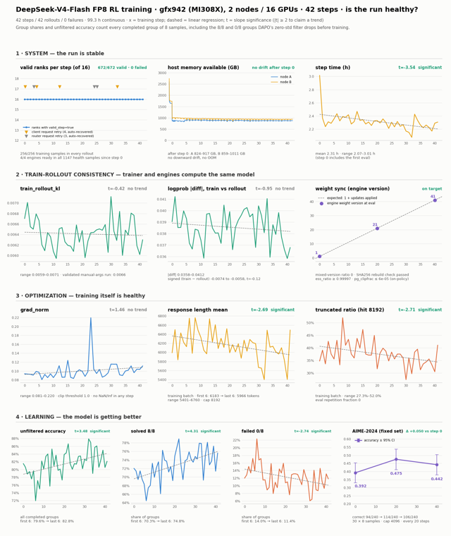

# miles-dsv4：AMD gfx942 双机训练验证

> **结论：miles-dsv4 的端到端强化学习训练链路已成功走通。**
>
> 在 **2 台 MI308X（gfx942）/ 16 GPU** 上，DeepSeek-V4-Flash FP8 连续运行 **99.3 小时、完成 42 个训练 step**，覆盖 `rollout → reward → DAPO/GRPO 优化 → 权重同步 → AIME 评测` 全流程。所有 rank 均有效、训练失败为 0，模型能力指标呈显著改善趋势。

## 实验结果一览

| 验证项 | 实验结果 | 结论 |
|---|---|---|
| 端到端稳定性 | 42 step × 16 rank = **672/672 有效，0 失败** | 双机训练链路稳定 |
| Rollout 完整性 | 42 次 rollout 均收齐 **256/256** 个样本，4 个推理引擎全程就绪 | 训推调度正常 |
| 训推一致性 | KL **0.0059–0.0071**；logprob 绝对差 **0.0358–0.0412**，均无漂移 | 训练端与推理端数值对齐 |
| 优化健康度 | grad norm 通常 **0.08–0.12**；42 step 无 NaN/Inf | 优化过程健康 |
| 训练集学习趋势 | 未过滤正确率 **79.6% → 82.8%** | 提升 3.2 个百分点，趋势显著 |
| 固定集评测 | AIME-2024：**0.392 → 0.475 → 0.442**（step 0/20/40） | step 40 较起点提升 5.0 个百分点 |

## 训练曲线

下图汇总了系统稳定性、训推一致性、优化健康度和学习效果四类关键证据：

## 为什么可以判定训练成功

### 1. 系统连续稳定运行

- 42 个 step 的 16 个 rank 全部有效，共 **672 次 rank-step，0 次失败**。
- 每次 rollout 均得到完整的 256 个训练样本，4 个 SGLang 推理引擎始终可用。
- 全程仅发生 4 次客户端请求重试和 3 次 router 请求重试，均自动恢复，未中断训练。
- 两台主机可用内存分别保持在 **824–917 GB** 和 **859–1011 GB**，无持续下降趋势、无 OOM。
- 稳定阶段单 step 平均约 **2.31 小时**。

### 2. 训练与推理保持一致

- `train_rollout_kl` 始终处于 **0.0059–0.0071**，无上升或漂移趋势。
- train/rollout 的 `logprob` 绝对差处于 **0.0358–0.0412**，与独立验证跑次一致。
- 推理引擎权重版本随训练准确递增；三个评测点使用版本 **1、21、41**，未出现混合版本。
- 前两个 step 的参数重建通过 SHA256 校验，确认权重同步链路正确。

### 3. 优化过程健康

- `grad_norm` 通常稳定在 **0.08–0.12**；仅 step 23 短暂达到 0.22，下一步即恢复，远低于裁剪阈值 1.0。
- 全部 42 个 step 均无 NaN/Inf。
- 回答平均长度由前 6 步约 **6183 token** 降至后 6 步约 **5966 token**，截断率同步下降。
- 未观察到输出塌缩或复读，AIME 评测中的复读率为 0。

### 4. 模型确实在学习

按每题 8 次采样的全部结果统计（包含被 DAPO 过滤的 8/8 全对组和 0/8 全错组）：

- 未过滤正确率：**79.6% → 82.8%**（t=3.48）；
- 8/8 全对题占比：**70.3% → 74.8%**（t=4.31）；
- 0/8 全错题占比：**14.0% → 11.4%**（t=−2.74）。

三项指标的趋势均达到统计显著。固定 AIME-2024 评测在 step 0、20、40 分别为 **0.392、0.475、0.442**；虽然评测值会受采样波动影响，step 40 仍比起点高 **5.0 个百分点**。

> 日志中的 `raw_reward` 不持续上升是 DAPO 动态过滤的预期行为：8/8 全对和 0/8 全错的样本组会在训练前被过滤，留下的始终是对错参半的中等难度题。因此，不能用过滤后的 `raw_reward` 直接判断模型是否学习，应结合上面的未过滤正确率和固定集评测。

## 实验配置

- **模型**：DeepSeek-V4-Flash FP8
- **硬件**：2 × AMD Instinct MI308X（每台 8 × 192 GB，gfx942），共 16 GPU
- **训练框架**：miles + Megatron-LM + SGLang
- **训练方法**：DAPO / GRPO，DAPO-Math-17k
- **Rollout**：32 道题 × 每题 8 次采样 = 256 个样本/step，最大回答长度 8192 token
- **评测**：AIME-2024，每 20 step 评测一次，每题 8 次采样
- **容器镜像**：`amdagi/miles-dsv4-flash:rocm7.0-gfx942-2node-20260927`

部署、启动和验收方法见 [MANUAL-dsv4-gfx942](./MANUAL-dsv4-gfx942.md)，镜像构建方法见 [Dockerfile.gfx942-dsv4](./Dockerfile.gfx942-dsv4), 详细log见[train.log](./train.log)。

## 结果口径

本次实验用于验证 gfx942 双机环境中的端到端训练可用性、稳定性、训推一致性和短程学习效果。连续 42 个 step 的结果足以证明训练闭环已成功跑通，但不等同于完整长程训练已经收敛。
